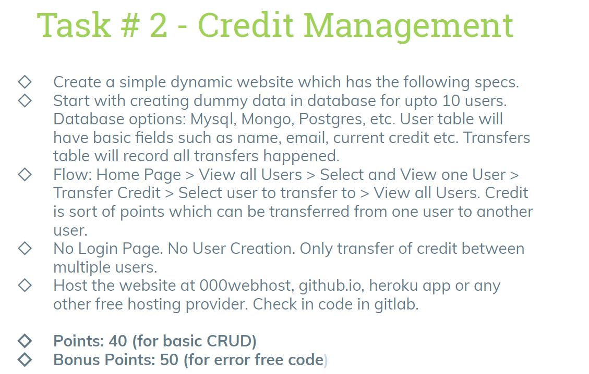
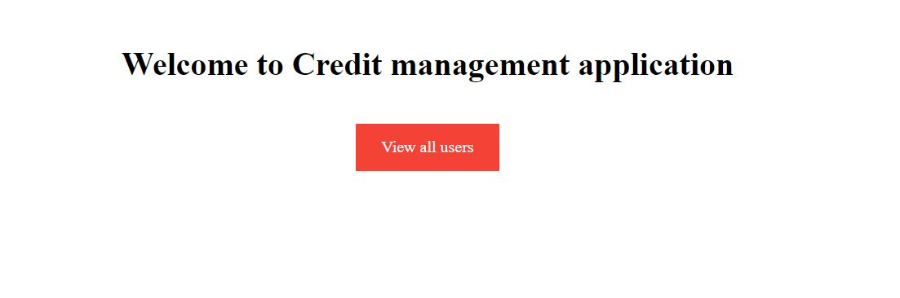
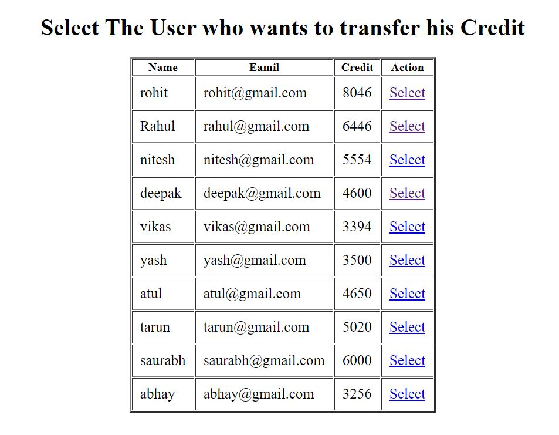
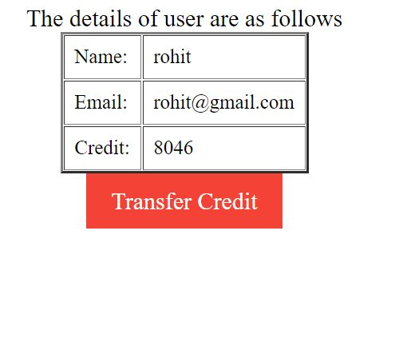
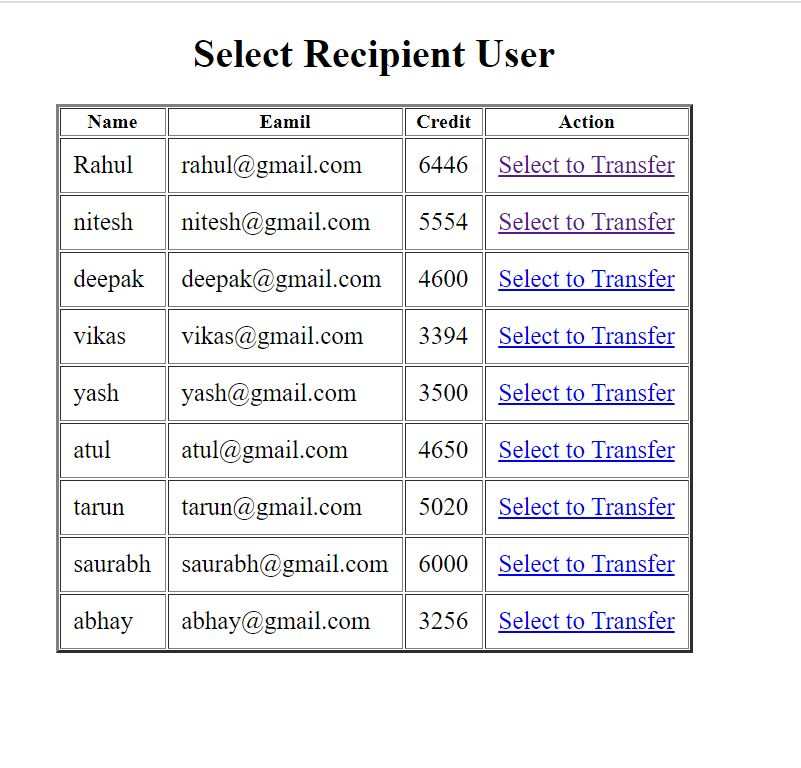
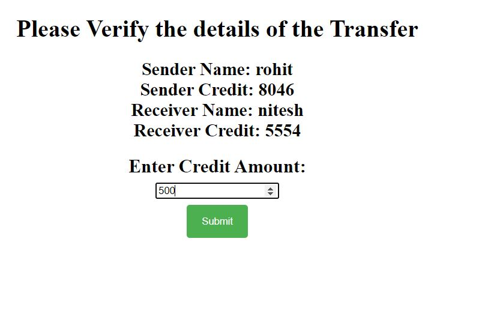
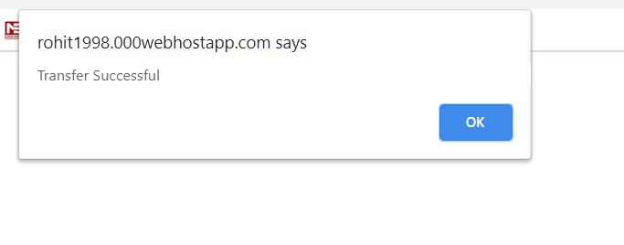

# Credit-Management-Website
A Simple Credit management Website to transfer credits from one account to another 
### This project was developed for a internship task 
### The main task is to create a Web application using various web technologies like php, html, css, javascript, which can be used to transfer Credit from one account to another. 
### Various Validations are also applied like 
1.One cannot transfer Credit to self
2.One cannot transfer more than the Credit avaliable in his account
### Task to Develop

### Screenshots of project
Home Page

Dashboard 

Sender details

Recipient User

Amount Selection

Transfer Sucess

